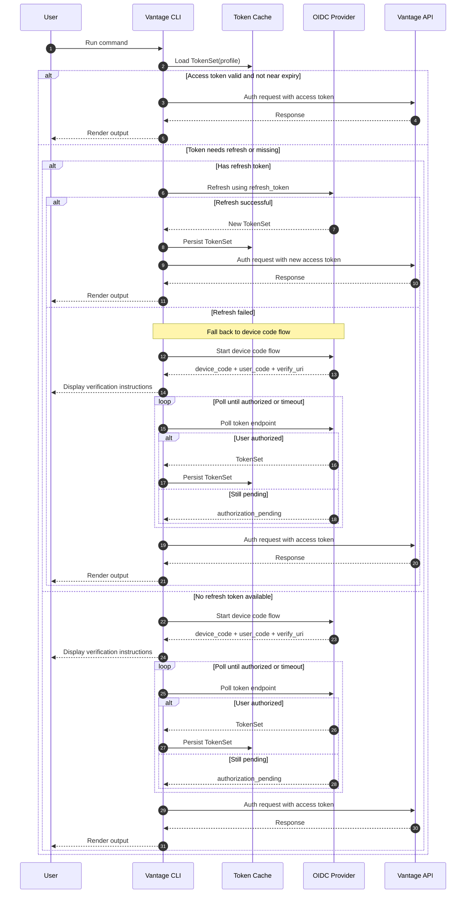

# Architecture

Concise view of internal structure & responsibilities.

## Goals

- Separate presentation (CLI/Rich) from logic (auth, config, clients)
- Safe token lifecycle (acquire, cache, refresh)
- Predictable profile-scoped configuration
- Async I/O for network efficiency
- Minimal global state

## Module Map

```text
vantage_cli/
    main.py        # Typer app + command registration
    auth.py        # Device code + refresh + persona
    cache.py       # Token cache load/save
    client.py      # Low-level HTTP helpers
    gql_client.py  # Async GraphQL client factory
    config.py      # Settings + profile mgmt + decorator
    constants.py   # Paths, filenames, env var names
    exceptions.py  # Exception hierarchy + Abort helper
    format.py      # Rich / JSON output helpers
    schemas.py     # Pydantic models (TokenSet, Persona, Settings, Persona)
    time_loop.py   # Simple polling / timing utility
```

## Execution Flow

1. CLI invoked
2. Active profile resolved
3. Settings loaded (file + env)
4. Tokens loaded / refreshed
5. Command executes (GraphQL/HTTP as needed)
6. Output rendered (human or JSON)

## Authentication Lifecycle

High-level states for token acquisition, caching, usage, and refresh.

```mermaid
flowchart TD
    A([Start Command]) --> B{Cached Access<br/>Token Valid?}
    B -->|Yes| C[[Use Token]]
    B -->|No| D{Have Refresh<br/>Token?}
    D -->|Yes| E[Refresh Access Token]
    E -->|Success| C
    E -->|Fail invalid/expired| F[Begin Device Code Flow]
    D -->|No| F
    F --> G[Display User Code & URL]
    G --> H[Poll Token Endpoint]
    H -->|Authorized| I[(Cache TokenSet)]
    H -->|Denied/Timeout| J[/Abort with Message/]
    I --> C
    C --> K{{API / GraphQL Calls}}
    K --> L[Render Output]
    L --> M([Exit])

    subgraph RC [" 🔄 On Each Command "]
        C --> N{Near Expiry?<br/>threshold}
        N -->|Yes| E
        N -->|No| C
    end
    
    classDef startEnd fill:#e1f5fe,stroke:#01579b,stroke-width:2px
    classDef decision fill:#fff3e0,stroke:#ef6c00,stroke-width:2px
    classDef process fill:#f3e5f5,stroke:#7b1fa2,stroke-width:2px
    classDef storage fill:#e8f5e8,stroke:#2e7d32,stroke-width:2px
    classDef error fill:#ffebee,stroke:#c62828,stroke-width:2px
    classDef api fill:#e3f2fd,stroke:#1565c0,stroke-width:2px
    
    class A,M startEnd
    class B,D,N decision
    class E,F,G,H,L process
    class I storage
    class J error
    class K api
```



## Authentication Sequence (Detailed)



Key guarantees:

- No device flow if a valid access token exists.
- Single refresh attempt per command; failures fall back to full device flow.
- Refresh threshold (e.g. < remaining lifetime) triggers proactive renewal.
- Token cache write is atomic (temp file + move) to avoid corruption.
- Abort messages are concise; verbose stack only with `-v`.

## Error Handling

- Domain exceptions map to concise messages
- Traceback only with `-v`
- Non-zero exit on expected user errors

## Models

- TokenSet: access/refresh/expiry
- Persona: identity claims
- Settings: endpoints & client config

## Extensibility

- New command groups = sub-app registration
- Decorators inject settings/persona
- Output helpers unify formatting

## Performance

- Async network calls
- Early return if tokens valid
- Small JSON read/write footprint

## Security

- Token files user-only permissions (expected)
- No token echoing
- Refresh guarded (no infinite retries)

## Future Ideas

- Pluggable credential stores
- Streaming subscriptions (GraphQL)
- Verbose timing metrics per command
